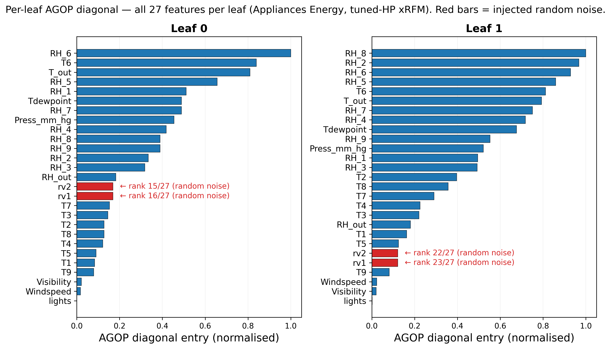
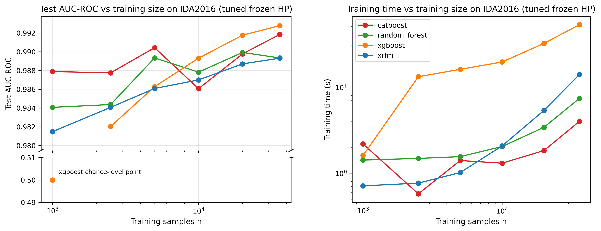

# xRFM: An Empirical and Interpretive Study of a Feature-Learning Kernel Machine for Tabular Data

**Group:** Project-1
**Members:** Haitao Gao (z5506409), Vladimir Pak (z5686616), Manav Garg (z5610871), Aaryash Bharadwaj (z5689921), John Zhang (z5591121)

---

## 1. Introduction

Tabular data resists deep learning: targets often jump abruptly along feature axes, scales are heterogeneous, and many columns are uninformative; gradient-boosted decision trees (GBDTs) handle these properties naturally [Grinsztajn et al., 2022]. Classical kernel methods do not displace them either: the kernel function fixes feature similarity *before* training (so it cannot learn that some features matter more than others), and kernel ridge regression costs $O(n^3)$, becoming intractable above ~70k samples.

**xRFM** [Beaglehole et al., 2025] tackles both limits. An inner Recursive Feature Machine [Radhakrishnan et al., 2024] learns which features matter via the Average Gradient Outer Product (AGOP), a matrix capturing how sensitive its predictions are to each input, and uses it to reshape the kernel. An outer balanced binary tree splits the data along the top AGOP eigenvector of a locally-fitted RFM, bringing training to $O(n \log n)$ and producing a separate AGOP per leaf for subpopulation interpretability. We test xRFM on five UCI datasets (verified absent from both the TALENT benchmark and xRFM's meta-test suite) against XGBoost, Random Forest, and CatBoost. We find xRFM is competitive on smooth-target tasks (Appliances Energy, Crop Mapping), trails on rule-like and small-$n$ problems (Seoul Bike, HCC), and is more hyperparameter-sensitive than CatBoost on imbalanced high-dimensional data (IDA2016), broadly consistent with the inductive-bias predictions of Grinsztajn et al. (2022).

## 2. Methodology

### 2.1 Average Gradient Outer Product (AGOP)

AGOP is the matrix at the heart of feature learning in xRFM. Intuitively, it asks: across the training set, in which input directions does the model's prediction change most? For a trained predictor $\hat f: \mathbb{R}^d \to \mathbb{R}$ and training set $\mathcal{S} = \{x^{(1)}, \ldots, x^{(n)}\}$, AGOP is computed by taking the gradient of $\hat f$ at every training point, then averaging the outer products:

$$
\mathrm{AGOP}(\hat f, \mathcal{S}) \;=\; \frac{1}{n}\sum_{i=1}^{n} \nabla \hat f\!\bigl(x^{(i)}\bigr)\,\nabla \hat f\!\bigl(x^{(i)}\bigr)^{\!\top} \;\in\; \mathbb{R}^{d\times d}. \tag{1}
$$

The result is a $d \times d$ matrix $M$ whose entries summarise the model's sensitivity. For any unit vector $v$, the quadratic form $v^\top M v$ measures how strongly $\hat f$ responds when its input moves along direction $v$. Two readouts of $M$ answer different questions:

- **Diagonal entries $M_{ii}$** give per-feature sensitivity. A large $M_{ii}$ means the model's output changes sharply when feature $i$ changes, holding the others fixed; this is a feature-importance score conceptually similar to a variance-based first-order sensitivity index.
- **Top eigenvectors of $M$** give the directions in feature space that the model actually uses (the *active subspace* of Constantine et al., 2014). The top eigenvector $v_1$ is a signed linear combination of features (positive and negative loadings push the prediction in opposite directions), capturing *joint* structure that the diagonal alone misses. Beaglehole et al. (2025, Fig. 7C) demonstrate this on Breast Cancer, where the top eigenvector identifies a signed pair of features driving malignancy scores.

**How AGOP compares to other importance methods.** The closest alternatives all answer slightly different questions. *PCA* finds high-variance directions of $x$ but ignores $y$, so its directions need not be predictive at all. *Mutual information* $I(X_i; Y)$ is model-free and easy to interpret per-feature, but cannot capture joint structure and requires density estimation. *Permutation importance* shuffles a feature and measures the loss change; it is black-box and intuitive, but known to behave poorly when features are correlated. AGOP sits at a different point on the trade-off: it is supervised (it depends on $\hat f$), joint (off-diagonal entries encode interactions), and computed in a single forward/backward pass. The cost is that AGOP inherits the model's biases: if $\hat f$ overfits noise, AGOP will assign that noise apparent importance. We see exactly this in §3.2.

### 2.2 The xRFM Algorithm

xRFM nests an iterative kernel-ridge RFM inside the leaves of a balanced binary tree whose internal splits use an AGOP-based supervised criterion.

**Tree construction.** Each internal node decides how to split its data. Given a node containing more than $L_{\max}$ points, xRFM trains a small RFM on a subsample and asks: *which direction in feature space does this RFM care about most?* That direction is the top eigenvector $v_1$ of the local AGOP. Every point in the node is then projected onto $v_1$ and split at the **median**, ensuring the tree stays balanced. The procedure recurses until every leaf has at most $L_{\max}$ points. Median splitting is what distinguishes xRFM from prior AGOP-based trees and is what guarantees $O(n \log n)$ training: each level halves the data, and the tree depth is $O(\log n)$.

**Leaf training.** At each leaf, an RFM is fitted using the generalised kernel $K_{p,q}(x, x') = \exp(-\|x - x'\|_p^q / L^q)$ (Schoenberg, 1942) for $0 < q \le p \le 2$. Two cases matter for our experiments: $q = 2$ recovers the rotation-invariant Laplace kernel (the library's `l2` mode), and $q = p$ gives an axis-aligned product kernel (`l1`). Starting with $M_0 = I$, the RFM iteration alternates two steps for up to $\tau \le 10$ rounds: (a) reshape inputs through the current AGOP via $x \to M_t^{1/2} x$; (b) solve kernel ridge regression $(K + \lambda I)\alpha_t = y$ on the reshaped inputs; (c) recompute AGOP from the resulting model; (d) normalise $M \leftarrow M / (\epsilon + \max_{ij}|M_{ij}|)$ to keep its scale bounded. We retain the iteration with the lowest *validation* error rather than running to convergence.

**Inference.** A test point $x^\star$ is routed through the tree (hard or soft median thresholds) to its leaf $\ell$, then predicted as $\hat y = K(x^\star \odot M_\ell^{1/2}, X_{M_\ell}) \alpha_\ell$. A single tree, with one predictor per test point and no ensembling.

**Computational complexity.** Training is $O(n \log n)$: leaves cap per-leaf cost at $O(L_{\max}^3)$ (constant in $n$), and median splits visit $O(n)$ points at each of $O(\log n)$ tree levels. Inference is $O(\log n + L_{\max})$ per sample. A naive kernel method costs $O(n^3)$ training and $O(n^2)$ memory, which becomes intractable above roughly 70,000 samples on a 40 GB GPU. xRFM preserves RFM's feature-learning while bypassing its scaling wall.

### 2.3 Experimental Design

**Datasets.** Five UCI datasets (Table 1) verified *absent* from both the TALENT benchmark's 300-dataset list and from xRFM's own meta-test suite. Two regression and three classification tasks, $n$ from 165 to 325,834, $d$ from 12 to 174. The selection deliberately spans different stress points for kernel methods: smooth-target regression (Appliances Energy, Crop Mapping), rule-like axis-aligned targets (Seoul Bike), small-$n$ with high $d/n$ (HCC), and high-$d$ class imbalance with heavy missingness (IDA2016). Appliances Energy serves double duty as our interpretability testbed because it ships with two ground-truth random features.

| # | Dataset (UCI ID) | $n$ | $d$ | Task | Features | Key property |
|---|------------------|-----|-----|------|----------|--------------|
| 1 | Seoul Bike Sharing (560) | 8,760 | 12 | Regression | 9 num + 3 cat | Strong weather × temporal interactions |
| 2 | Appliances Energy (374) | 19,735 | 27 | Regression | All numeric | **Contains 2 ground-truth noise features (rv1, rv2)** |
| 3 | HCC Survival (423) | 165 | 49 | Binary | 22 num + 27 cat | Small-$n$, heavy missingness |
| 4 | IDA2016 Scania APS (414) | 60,000 | 170 | Binary | All numeric | Class imbalance (~1.6% positive) |
| 5 | Crop Mapping, Winnipeg (525) | 50,000* | 174 | Multiclass (7) | All numeric | SAR+optical satellite; *stratified from 325,834 |

**Splits.** Stratified 60/20/20 train/val/test with `random_state=42` (stratified on target for classification, random for regression). Results are single-seed; variance estimates would require multiple seeds, an acknowledged limitation.

**Preprocessing.** Median imputation for numerics, mode imputation for categoricals. For kernel methods (xRFM): standard-scaled numerics + one-hot-encoded categoricals. For tree ensembles: numerics plus ordinal-encoded categoricals (no standardisation, preserving split structure). CatBoost receives native categorical indices.

**Hyperparameter tuning.** Optuna TPE sampler optimises the validation-split primary metric (RMSE for regression, AUC-ROC for binary, accuracy for multiclass) with model-specific trial budgets (xRFM 25, XGBoost 40, CatBoost 30, Random Forest 20). xRFM gets fewer trials because each kernel-ridge solve is the wall-clock bottleneck. The configuration with the best validation objective is retrained on the train split and evaluated once on held-out test. Full search spaces, fixed knobs, and per-dataset selected HPs are in Appendix B. Note that `max_leaf_size = min(60000, n_train)` forces xRFM into a single-leaf-RFM regime on all five main-comparison datasets; the tree component is engaged only in the §3.2 interpretability run (2 leaves on Appliances) and at $n=36k$ in §3.3.

**Metrics.** Regression: RMSE (primary) and $R^2$. Classification: Accuracy and AUC-ROC (macro-OvR for multiclass). Plus wall-clock training time and per-sample inference time.

## 3. Results

### 3.1 Main comparison

Tables 2 and 3 report final test-set metrics for all four models on all five datasets.

**Table 2. Regression results (lower RMSE is better; best per dataset in bold). Train and Inf are wall-clock training time (s) and per-sample inference time (µs).**

\begingroup\footnotesize

| Dataset | Metric | xRFM | XGBoost | CatBoost | RF |
|:--------|:-------|-----:|--------:|---------:|---:|
| Appliances Energy | RMSE/R² | **65.29/0.574** | 65.75/0.568 | 66.96/0.552 | 72.61/0.473 |
|                   | Train/Inf | 11.5/26 | 41.7/95 | 11.1/**3.5** | **1.7**/41 |
| Seoul Bike        | RMSE/R² | 238.44/0.864 | 232.32/0.870 | **225.66/0.878** | 245.64/0.855 |
|                   | Train/Inf | 2.1/16 | 5.4/37 | 5.2/**1.9** | **0.5**/57 |

\endgroup

**Table 3. Classification results (higher Accuracy / AUC-ROC is better; best per dataset in bold). Train and Inf as in Table 2.**

\begingroup\footnotesize

| Dataset | Metric | xRFM | XGBoost | CatBoost | RF |
|:--------|:-------|-----:|--------:|---------:|---:|
| HCC Survival | Acc/AUC | 0.758/0.800 | 0.818/0.835 | 0.788/0.819 | **0.849/0.850** |
|              | Train/Inf | 0.1/50 | **0.0**/**19** | 0.6/47 | 0.9/3667 |
| IDA2016      | Acc/AUC | 0.990/0.990 | 0.993/**0.993** | **0.994**/0.992 | 0.992/0.989 |
|              | Train/Inf | 16.9/5.9 | 52.1/30 | **3.1**/**0.5** | 5.8/15 |
| Crop Mapping | Acc/AUC | **0.995/1.000** | 0.991/1.000 | n/a | 0.989/1.000 |
|              | Train/Inf | 12.8/**2.6** | 40.0/20 | n/a | **12.2**/24 |

\endgroup

*Seeds fixed at 42. TabPFN-v2 omitted throughout (see §4 for rationale). CatBoost on Crop Mapping timed out on our 2-hour Modal budget at 7-class × 30k × 174-feature scale and is omitted; the other three models on Crop Mapping all converge. "Best" per dataset in bold; ties broken by AUC for binary, Accuracy for multiclass.*

Tuning chose `kernel=l1` (axis-aligned) for the two lowest-$d$ datasets (Appliances, Seoul Bike) and `kernel=l2` (rotation-invariant) for the three higher-$d$ datasets (HCC, IDA2016, Crop Mapping); per-dataset HPs are in Appendix B.

Observations on the numbers:

**xRFM is competitive on the smooth-target datasets.** On Appliances Energy it obtains the best RMSE in this single split, but the margin over XGBoost is small (65.29 vs 65.75) and should not be over-interpreted without multi-seed error bars. On Crop Mapping, xRFM is best among the completed models, but CatBoost timed out, so this is not evidence that xRFM dominates all GBDT baselines. The inference-time numbers are useful operational context, but they are implementation wall-clock measurements rather than hardware-normalised algorithmic benchmarks.

**The GBDTs win where rules and small-$n$ favour them.** CatBoost narrowly leads on Seoul Bike (all four models within 9% of each other); the rule-like target (zero rentals when the system is off, season × hour interactions) plays to tree splitting. On HCC Survival, Random Forest leads xRFM by 9 accuracy points; with only 33 test samples, differences under $\pm 6$ accuracy-points are not statistically distinguishable at the 5% level.

**IDA2016 is the HP-sensitivity story.** Tuned xRFM reaches AUC 0.990, within 0.3 AUC-points of XGBoost (0.9928) and CatBoost (0.9918). An earlier default-HP sweep gave xRFM only about 0.978, while the tuned frozen-HP scaling rerun in §3.3 reaches 0.989 at full size. The tuned-vs-default gap is larger than the tuned xRFM-vs-GBDT gap, so most of xRFM's apparent loss is HP sensitivity, not algorithmic inferiority. We return to this in §4.

### 3.2 Interpretability on Appliances Energy

We use Appliances Energy as our interpretability testbed for two reasons. First, it includes two ground-truth random features (`rv1`, `rv2`) injected by the dataset's authors, which gives us a direct test of whether each importance method correctly ranks pure noise as low importance. Second, the 27 features have physical meanings (kitchen humidity, outdoor temperature, and so on), which lets us sanity-check the rankings against domain intuition.

**Setup.** We extract per-leaf AGOP diagonals from the xRFM trained with the Optuna-tuned hyperparameters from §3.1 (`kernel='l1', bandwidth=12.72, exponent=0.79, reg=0.061, diag=True`). With `diag=True` the Mahalanobis matrix is constrained to be diagonal, so we report only per-feature sensitivities; the paper's signed-eigenvector analysis (e.g., Fig. 7C on Breast Cancer) requires `diag=False` and is left as a follow-up. We compare AGOP against three alternatives chosen to span the importance-method design space: PCA loadings (an unsupervised baseline), mutual information (model-free, supervised), and signed permutation importance computed on an XGBoost proxy (black-box, supervised). Figure 1 ranks the top-15 features by AGOP and overlays the other three methods. Figure 2 shows AGOP per leaf, replicating the multi-leaf comparison the paper performs on NYC Taxi data (Beaglehole et al. 2025, Fig. 7B).

![Feature importance comparison on Appliances Energy. [*] marks the two injected random features.](../figures/interpretability_appliances.png){ width=100% }

{ width=100% }

**The random-feature test.** The cleanest cross-method comparison is how each method ranks `rv1` and `rv2`, features that, by construction, carry zero signal. Out of $d=27$ features, mutual information ranks them 26/27 and 27/27, and signed permutation importance ranks them 27/27 and 26/27: both cleanly identify the noise. AGOP places them at 21/27 and 20/27, correct in direction but less decisive than the model-free methods. PCA fails outright, ranking them at **2/27 and 1/27** (wrongly at the top), because random uniforms are statistically independent of the other (correlated) sensor readings and so contribute disproportionately to the input covariance.

*(AGOP and PCA each assign `rv1`, `rv2` exactly equal scores, so the rank distinctions in the table are tie-break artefacts. Per-leaf AGOP ranks are 15–16/27 in leaf 0 and 22–23/27 in leaf 1, so noise demotion strengthens with deeper splits.)*

**What the random features tell us about AGOP.** Two findings sit beneath the ranks. First, AGOP gives `rv1` and `rv2` exactly the same score because the model treats them as interchangeable noise; the AGOP iteration converges to the same diagonal entry by symmetry. The non-zero value (0.169 in leaf 0, 0.122 in leaf 1) is a residual that a finite-iteration kernel-ridge solver cannot drive to zero: the gap between "model-aware" and "model-free" measures (MI assigns clean zeros). Second, AGOP's noise rejection depends on the underlying kernel fit: re-running with default HPs (`bandwidth=10, kernel='l2', diag=False`) moves `rv1`, `rv2` to ranks 12–13 instead of 20–21, a nine-position drop in discrimination. AGOP only sees what the model sees, so we use it to interpret what a *tuned* model has learned, not as a model-free importance measure.

**Per-leaf structure shows subpopulation-specific features.** The two leaves of the tuned tree concentrate on different humidity sensors: leaf 0 weights RH_6 (kitchen humidity) maximally (AGOP $= 1.00$), while leaf 1 weights RH_8 (parents' room humidity) maximally ($= 1.00$). T6 (outdoor temperature) and RH_5 (bathroom humidity) are high in both. This mirrors the pattern Beaglehole et al. (2025, Fig. 7B) report for NYC Taxi, where different tree leaves discovered different locally-relevant features. With only two leaves on Appliances we see the effect on a small scale; deeper trees on larger datasets would amplify it.

**Where the methods agree on real features.** Both supervised methods that pass the noise test (AGOP and signed permutation) identify a humidity-dominated mix of sensors. AGOP's top features are RH_6, T6, T_out, RH_5, RH_8; permutation's top-5 are RH_4, RH_2, RH_1, RH_8, T4, and four of those five appear in AGOP's top-10. They disagree on which humidity sensor matters most but agree on the qualitative story: indoor humidity, not outdoor temperature alone, dominates the energy signal.

### 3.3 Scaling study on IDA2016

Figure 3 plots test AUC-ROC and training time against subsampled training size $n \in \{1k, 2.5k, 5k, 10k, 20k, 36k\}$, with the test set held fixed. Unlike the earlier default-HP sweep, this rerun freezes each model's Optuna-selected full-$n$ hyperparameters from §3.1 and refits preprocessing on each subsampled training set only. The AUC panel uses a broken y-axis so the XGBoost $n=1k$ chance-level point remains visible while the $0.98+$ comparison band is readable.

{ width=100% }

This design better isolates the effect of training-set size than the default-HP sweep, but it is still single-seed and should not be read as an asymptotic complexity test. Three observations:

1. **Tuned sample scaling.** xRFM improves from AUC 0.981 at $n=1k$ to 0.989 at $n=36k$, essentially matching RF at full size (0.989) but remaining below CatBoost (0.992) and XGBoost (0.993). CatBoost is already strong at $n=1k$ (AUC 0.988). XGBoost's full-$n$ tuned configuration fails at $n=1k$ (AUC 0.500) before recovering, showing why frozen-HP scaling should be interpreted as configuration-specific rather than universally sample-efficient.

2. **Tree engagement is shallow.** Logged xRFM metadata shows one leaf through $n=20k$ and two leaves at $n=36k$, because the library rescales the effective `max_leaf_size` to about 26.6k on the A10G. Thus the sweep mostly measures leaf-RFM behaviour, with only the largest point entering a shallow partitioned regime.

3. **Training time.** xRFM grows from 0.71 s at $n=1k$ to 13.93 s at $n=36k$ (19.6× growth; log-log slope 0.84). It is faster than XGBoost at full size (52.7 s) but slower than CatBoost (4.0 s) and RF (7.4 s). These timings remain wall-clock implementation measurements, not proof of the paper's $O(n \log n)$ asymptotic claim.

## 4. Discussion

**The results are broadly consistent with the inductive-bias story, but not decisive.** The theoretical argument for feature-learning kernel methods is that they should be strongest when the target varies *smoothly* with the inputs because the model can profit from re-weighting the directions that matter. Appliances Energy and Crop Mapping are consistent with that story, but the Appliances margin over XGBoost is small and Crop Mapping lacks a completed CatBoost comparison. The mirror image is Seoul Bike: rentals follow sharp rules (zero when the system is off) and multiplicative interactions (season × hour), exactly the structure trees split on naturally, and the GBDTs win, narrowly.

The surprise is HCC Survival. Classical kernel theory says kernels should dominate trees in the small-$n$ regime, since RKHS regularisation provides a strong prior. We expected xRFM to win here. Instead Random Forest beats it by 9 accuracy points. We suspect the cause is AGOP estimation: with only 99 training samples, learning a $108 \times 108$ AGOP matrix (the encoded dimension after one-hot expansion of the 27 categorical features) is statistically fragile, and a noisy AGOP feeds back into a noisy reweighting that hurts more than it helps.

**xRFM is more hyperparameter-sensitive than the GBDTs.** IDA2016 makes this clearest. With HP tuning, xRFM achieves AUC about 0.990, within 0.3 AUC-points of CatBoost and XGBoost. The earlier default-HP scaling sweep gave xRFM only about 0.978, while the tuned frozen-HP rerun in §3.3 reaches 0.989 at full size. The 1.1–1.2 point gap is primarily a configuration effect. Three structural features of IDA2016 stress kernel methods more than trees, and each matches one of Grinsztajn et al. (2022)'s predictions about why kernels lose on tabular data:

- **Severe class imbalance (1.6% positive).** Kernel ridge regression minimises squared error symmetrically, so it has no built-in mechanism to up-weight the rare class. GBDTs can be told to up-weight the minority directly. xRFM can compensate through bandwidth and ridge tuning, but only if those HPs are actually searched.
- **170 dimensions, most low-signal.** xRFM has to *learn* via AGOP which features matter; trees ignore irrelevant features for free through split selection.
- **Heavy missingness (8.3% of cells).** In our pipeline all models receive median-imputed numeric features, so we did not test native tree missing-value handling. A more defensible hypothesis is that median imputation may distort similarity geometry more for kernels than for split-based models.

**Choice of metrics.** We report RMSE rather than MAE for regression because both Appliances Energy and Crop Mapping have heavy-tailed targets where large errors deserve disproportionate penalty; $R^2$ accompanies RMSE for cross-dataset comparability since target ranges differ by orders of magnitude (Appliances mean 97 Wh vs. Seoul Bike mean 705 rentals). For classification we report both Accuracy and AUC-ROC, but on IDA2016 (1.6% positive) AUC is the load-bearing number, since accuracy $\approx 0.984$ is trivially achievable by always predicting "no failure", while AUC tests rank-ordering of failure probabilities, so the fact that all four models exceed 0.989 says they actually learn the rare class. Inference time per sample is operational context rather than algorithmic benchmark: it is wall-clock on shared cloud hardware and not normalised across implementations. In particular, xRFM was run on GPU (CUDA) while XGBoost, CatBoost, and Random Forest ran on CPU, so the train/inference times in Tables 2–3 reflect a hardware asymmetry alongside algorithmic differences and should not be read as a method-fair complexity comparison.

**AGOP's strength and its cost.** AGOP inherits the model's learned feature sensitivity, which cuts both ways: a well-tuned RFM produces a discriminating AGOP that correctly demotes random noise to ranks 20–21 of 27; a badly-tuned RFM produces an AGOP that places the same noise at 12–13. Mutual information and signed permutation sidestep this dependency. The takeaway: **AGOP for interpreting a tuned model, MI or signed permutation as a model-free sanity check, PCA as a null baseline.**

**Limitations and next steps.**

- **Single-seed results.** All experiments use one fixed seed (42). Small differences (especially on HCC's 33-sample test set) may not survive multi-seed replication. Multi-seed runs would let us put error bars on every comparison.
- **Restricted kernel-family search.** The paper's full kernel family is $K_{p,q}$ for $0 < q \le p \le 2$, a 2D grid over $(p, q)$. Our HP search varies only a single `exponent` parameter and restricts kernel choice to two slices: `l1` ($K_{p,p}$, axis-aligned) and `l2` ($K_{p,2}$, rotation-invariant). The tuned HPs picked `l1` on Appliances Energy and Seoul Bike, `l2` on the other three datasets (`results/downloads/main_*_xrfm_seed42.json`), so both slices saw use, but sweeping the full $(p, q)$ grid is the natural follow-up.
- **Tree-partitioning regime only lightly tested.** The tuned scaling rerun logs one xRFM leaf through $n=20k$ and two leaves at $n=36k$ after the library rescales effective `max_leaf_size` to about 26.6k. This is useful evidence, but it is still not a clean test of the full partitioned-tree regime. A dedicated follow-up should explicitly sweep smaller `max_leaf_size` values.
- **TabPFN-v2 omitted.** TabPFN-v2 would be a useful third baseline (a tabular foundation model, neither tree nor kernel). Its license gates weight download behind interactive acceptance, which blocked our headless Modal pipeline.
- **Shallow interpretability tree.** Both our default-HP and tuned-HP interpretability runs produced only 2 leaves. The richer per-leaf comparison the paper performs on NYC Taxi (Beaglehole et al. 2025, Fig. 7A, with 8 leaves) would require a larger dataset to induce deeper trees.

## 5. Conclusion

xRFM is a credible complement to GBDTs in these experiments, especially where AGOP interpretability is useful. On our five UCI datasets it is competitive on smooth-target tasks (Appliances Energy, Crop Mapping), improves substantially with HP tuning on imbalanced high-dimensional classification (IDA2016), and trails on small-$n$ (HCC) and rule-like targets (Seoul Bike) where tree inductive bias is better matched. However, the evidence is single-seed, only lightly exercises xRFM's tree partitioning, and is not sufficient to establish robust superiority over XGBoost or CatBoost.

## References

1. Beaglehole, D., Holzmüller, D., Radhakrishnan, A., & Belkin, M. (2025). *xRFM: Accurate, scalable, and interpretable feature learning models for tabular data*. arXiv:2508.10053.
2. Radhakrishnan, A., Beaglehole, D., Pandit, P., & Belkin, M. (2024). Mechanism for feature learning in neural networks and backpropagation-free machine learning models. *Science*, **383**(6690).
3. Chen, T., & Guestrin, C. (2016). XGBoost: A scalable tree boosting system. In *KDD 2016*.
4. Breiman, L. (2001). Random Forests. *Machine Learning*, **45**(1), 5–32.
5. Prokhorenkova, L., Gusev, G., Vorobev, A., Dorogush, A. V., & Gulin, A. (2018). CatBoost: unbiased boosting with categorical features. In *NeurIPS 2018*.
6. Hollmann, N., Müller, S., Purucker, L., Krishnakumar, A., Körfer, M., Hoo, S. B., Schirrmeister, R. T., & Hutter, F. (2025). Accurate predictions on small data with a tabular foundation model. *Nature*, **637**.
7. Grinsztajn, L., Oyallon, E., & Varoquaux, G. (2022). Why do tree-based models still outperform deep learning on typical tabular data? In *NeurIPS 2022 Datasets & Benchmarks Track*.
8. Ye, H.-J., Liu, S.-Y., Rong, H.-R., Lu, P.-X., Du, J.-Y., Chao, W.-L., Wang, Z.-J., Sun, Q., & Jiang, Y. (2024). *A Closer Look at Deep Learning on Tabular Data (TALENT)*. arXiv:2407.00956.
9. Constantine, P. G., Dow, E., & Wang, Q. (2014). Active subspace methods in theory and practice. *SIAM J. Sci. Comput.*, **36**(4).
10. Beaglehole, D., Súkeník, P., Mondelli, M., & Belkin, M. (2024). Average gradient outer product as a mechanism for deep neural collapse. In *NeurIPS 2024*.
11. Candanedo, L. M., Feldheim, V., & Deramaix, D. (2017). Data driven prediction models of energy use of appliances in a low-energy house. *Energy and Buildings*, **140**, 81–97.
12. Dua, D., & Graff, C. (2017). UCI Machine Learning Repository. University of California, Irvine.
13. Akiba, T., Sano, S., Yanase, T., Ohta, T., & Koyama, M. (2019). Optuna: A next-generation hyperparameter optimization framework. In *KDD 2019*.

## Appendix A: Dataset Feature Descriptions

### A.1 Seoul Bike Sharing (UCI 560)

Hourly rental counts in Seoul, Sept 2017 – Nov 2018 ($n=8{,}760$, $d=12$). Target: `Rented_Bike_Count` $\in [0, 3556]$, mean 704.6, std 645.0. **No missing values.**

- **Numeric (9):** `Hour` (0–23), `TemperatureC` (−17.8 to 39.4), `Humiditypct` (0–98), `Wind_speed_m/s` (0–7.4), `Visibility_10m` (27–2000), `Dew_point_temperatureC` (−30.6 to 27.2), `Solar_Radiation_MJ/m²` (0–3.52), `Rainfallmm` (0–35), `Snowfall_cm` (0–8.8).
- **Categorical (3):** `Seasons` (4 levels), `Holiday` (Yes/No), `Functioning_Day` (Yes/No).

The target follows clear rules: rentals are exactly zero whenever the bike system is off (`Functioning_Day=No`); otherwise demand has two daily peaks (morning and evening commutes); and the time-of-day pattern depends strongly on the season. These are exactly the kind of axis-aligned, piecewise-constant patterns that decision trees handle naturally, which is a structural reason to expect GBDTs to do well here.

### A.2 Appliances Energy Prediction (UCI 374)

10-minute energy readings from a Belgian house ($n=19{,}735$, $d=27$, all numeric). Target: `Appliances` (Wh) $\in [10, 1080]$, mean 97.7, std 102.5. **No missing values.**

- **Indoor sensors (18):** `T1`–`T9` (room temperatures, 14.9–29.9 °C), `RH_1`–`RH_9` (room humidities, 1–100%).
- **Outdoor weather (7):** `T_out`, `Press_mm_hg`, `RH_out`, `Windspeed`, `Visibility`, `Tdewpoint`, `lights`.
- **Random noise (2):** `rv1`, `rv2`, both drawn from $\mathcal{U}(0, 50)$ by Candanedo et al. (2017) as ground-truth-irrelevant features. Used as the "noise rejection" check in §3.2.

### A.3 HCC Survival (UCI 423)

Hepatocellular carcinoma 1-year survival in a Portuguese cohort ($n=165$, $d=49$). Target: binary survival outcome, **class balance 102 lives : 63 dies (62%/38%)**. **826 missing values (10.2% of cells).** Features anonymised as `x0`–`x48`.

- **Categorical (27):** `x0`–`x22` are 22 binary clinical flags (cirrhosis, alcoholism, hepatitis, ascites, etc.); `x26` (5 levels: ECOG performance status), `x27`/`x28` (3 levels each: encephalopathy/ascites grades), `x43` (6 levels: Child-Pugh).
- **Numeric (22):** Lab values with widely varying scales: `x23` (age, 20–93), `x30` (likely AFP, range 1.2 to 1.8M), `x33`/`x34` (likely AST/ALT, max 13k and 459k respectively), plus haemoglobin, platelets, bilirubin, INR, creatinine, iron studies. Missingness up to 48% on rarely-ordered tests.

High $d/n \approx 0.30$, which is the report's primary hypothesis for xRFM's underperformance on this dataset.

### A.4 IDA2016 Scania APS (UCI 414)

Heavy-truck Air Pressure System failure prediction ($n=60{,}000$, $d=170$, all numeric). Target: binary (failure/no), **class balance 59,000 : 1,000 (1.67% positive).** **850,015 missing values (8.3% of cells).**

Features are anonymised sensor readings (`aa_000`, `ab_000`, …); the `ag_000`–`ag_009` series are histogram bins of one underlying counter. **Eight columns are >50% missing** (e.g., `br_000` 82%, `bq_000` 81%, `bp_000` 80%). All three properties stress kernel methods specifically. With 170 mostly-uninformative dimensions, xRFM has to *learn* which features matter, whereas trees ignore irrelevant features for free via split selection. With only 1.6% positive class, kernel ridge regression has no built-in mechanism for asymmetric error costs, where GBDTs can be told to up-weight the minority. And with 8.3% of cells missing, although tree-based methods can in principle absorb missingness through their split logic, our pipeline imputes upstream (median for numerics, mode for categoricals) for all four models, so the kernel-vs-tree distinction here reduces to how well median imputation preserves geometry, not native missing-value handling. We expected this dataset to be the hardest of our five for xRFM, and it was.

### A.5 Crop Mapping, Winnipeg (UCI 525)

Crop classification from fused satellite data over Manitoba, 2015–2016 ($n=325{,}834$, stratified-subsampled to $n=50{,}000$; $d=174$, all numeric, no missing). Target: 7 crop classes, with **highly skewed prevalence** (largest class 26.1%; smallest 0.35%, only 175 samples).

Features come from two satellite systems collected at multiple dates: **RADARSAT-2 synthetic aperture radar** (4 polarisation channels: HH, HV, VH, VV; plus derived parameters) and **Landsat-8 optical bands** (visible, near-infrared, short-wave infrared). Raw values span roughly $[-28{,}400, 1{,}089{,}300]$; the radar measurements are in negative-dB units while optical radiances are large positive numbers, so standardisation is essential. Crucially for our hypothesis, all 174 features are continuous and physically correlated: the kind of smooth, structured feature space where a kernel's similarity-based assumption matches the data well.

## Appendix B: Hyperparameter Tuning Details

**B.1 Optuna setup.** TPE sampler seeded with `random_state=42`. Validation objective: RMSE (minimise) for regression, AUC-ROC (maximise) for binary, accuracy (maximise) for multiclass. The configuration with the best validation objective is retrained on the train split and evaluated once on held-out test.

**B.2 Search spaces and fixed knobs.**

- **xRFM** (25 trials). Tunable: `bandwidth` $\in [1, 200]$ log, `exponent` $\in [0.7, 1.4]$, `kernel` $\in \{$ `l1`, `l2` $\}$, `reg` $\in [10^{-6}, 1]$ log, `diag` $\in \{T, F\}$. Fixed: `iters=5`, `M_batch_size=1000`, `bandwidth_mode=constant`, `max_leaf_size=min(60000, n)`.
- **XGBoost** (40 trials). Tunable: `max_depth` $\in [3, 12]$, `learning_rate` $\in [10^{-3}, 0.3]$ log, `subsample` $\in [0.5, 1]$, `colsample_bytree` $\in [0.5, 1]$, `reg_alpha` $\in [10^{-8}, 10]$ log, `reg_lambda` $\in [10^{-8}, 10]$ log, `min_child_weight` $\in [1, 10]$. Fixed: `n_estimators=2000` with `early_stopping_rounds=50`.
- **CatBoost** (30 trials). Tunable: `depth` $\in [4, 10]$, `learning_rate` $\in [10^{-3}, 0.3]$ log, `l2_leaf_reg` $\in [10^{-2}, 10]$ log, `bagging_temperature` $\in [0, 1]$, `border_count` $\in \{32, 64, 128, 254\}$. Fixed: `iterations=2000` with `early_stopping_rounds=50`.
- **Random Forest** (20 trials). Tunable: `n_estimators` $\in [200, 1000]$, `max_depth` $\in [5, 30]$, `min_samples_split` $\in [2, 20]$, `min_samples_leaf` $\in [1, 10]$, `max_features` $\in \{$ `sqrt`, `log2`, $0.5$ $\}$.

**B.3 Selected HPs per dataset.** Best configurations from Optuna's TPE search (extracted from `results/main_*_seed42.json`). RF abbreviations: `mss`=`min_samples_split`, `msl`=`min_samples_leaf`.

*xRFM:*

- Appliances Energy: `bw`=12.72, `exp`=0.79, `kernel`=l1, `reg`=0.061, `diag`=T
- Seoul Bike: `bw`=2.09, `exp`=0.90, `kernel`=l1, `reg`=0.051, `diag`=F
- HCC Survival: `bw`=23.08, `exp`=0.73, `kernel`=l2, `reg`=2.5×10⁻⁶, `diag`=F
- IDA2016: `bw`=199.3, `exp`=1.27, `kernel`=l2, `reg`=0.95, `diag`=T
- Crop Mapping: `bw`=4.11, `exp`=1.18, `kernel`=l2, `reg`=5.4×10⁻⁶, `diag`=T

*XGBoost:*

- Appliances Energy: `depth`=12, `lr`=0.042, `sub`=0.98, `col`=0.51, `α`=0.007, `λ`=1.48, `mcw`=2
- Seoul Bike: `depth`=7, `lr`=0.007, `sub`=0.62, `col`=0.99, `α`=3×10⁻⁶, `λ`=4×10⁻⁴, `mcw`=2
- HCC Survival: `depth`=5, `lr`=0.253, `sub`=0.83, `col`=0.78, `α`=0.026, `λ`=0.14, `mcw`=2
- IDA2016: `depth`=8, `lr`=0.004, `sub`=0.87, `col`=0.75, `α`=0.41, `λ`=9.65, `mcw`=10
- Crop Mapping: `depth`=3, `lr`=0.160, `sub`=0.69, `col`=0.72, `α`=6×10⁻⁶, `λ`=2×10⁻⁵, `mcw`=5

*CatBoost:*

- Appliances Energy: `depth`=9, `lr`=0.051, `l2`=0.066, `bag`=0.35, `border`=254
- Seoul Bike: `depth`=8, `lr`=0.031, `l2`=0.115, `bag`=0.36, `border`=64
- HCC Survival: `depth`=8, `lr`=0.057, `l2`=0.012, `bag`=0.97, `border`=32
- IDA2016: `depth`=9, `lr`=0.137, `l2`=4.37, `bag`=0.85, `border`=64
- Crop Mapping: timed out (see §3.1).

*Random Forest:*

- Appliances Energy: `n`=652, `depth`=24, `mss`=10, `msl`=1, `max_feat`=sqrt
- Seoul Bike: `n`=422, `depth`=25, `mss`=12, `msl`=3, `max_feat`=0.5
- HCC Survival: `n`=796, `depth`=24, `mss`=17, `msl`=1, `max_feat`=log2
- IDA2016: `n`=599, `depth`=24, `mss`=5, `msl`=7, `max_feat`=log2
- Crop Mapping: `n`=652, `depth`=24, `mss`=10, `msl`=1, `max_feat`=sqrt
